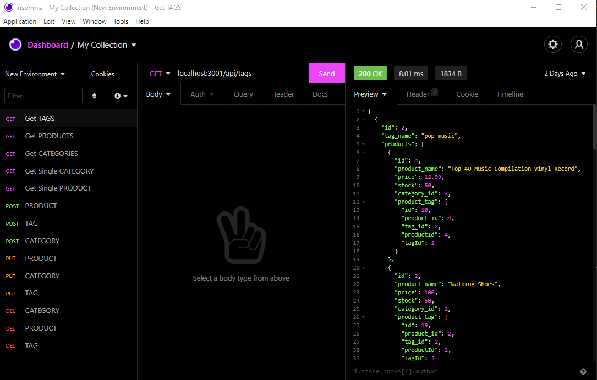

# E-Commerce Backend

## Description
This application is a MVC backend to manage an e-commerce inventory.  The database includes products, which belong to categories.  The products can also have tags to help with searching.  Each category, product and tag can be updated, read, or deleted.  Each can also be created.

## Installation Instructions
schema.sql must be sourced in mysql in order to create the database on your computer.  The index.js in the seeds folder must also be run so that the database can be seeded.  As always, please npm before running so that the express, sequalize, and routes packages can be downloaded.  Enter 'node server' in there terminal to begin the server and have it start listening to routes.  Insonomia or a similar front end API front-end client to test the outputs and success of the routes pinged to the server.

## ScreenCastify
 Please watch the first, then the second screencastify videos.

https://watch.screencastify.com/v/IuqIp8S6qad9KiS82Sab

https://watch.screencastify.com/v/YnHcVEM4LCeK9fQ8rkcv

## Screenshots

